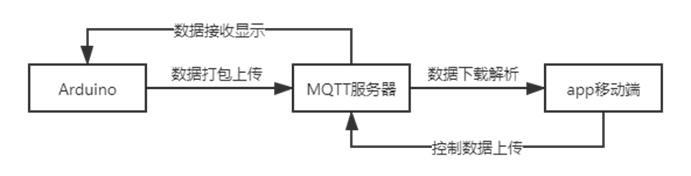
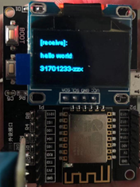
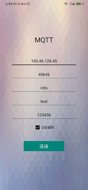
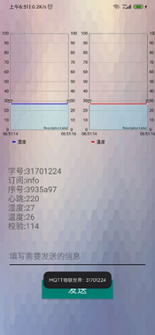

# MQTT_Iotkit_by_Android

功能设计：客户端硬件上传温湿度数据到MQTT数据平台的Topic，通过Arduino作为硬件进行编程，Json格式打包数据，移动端核对IP地址，端口号以及必要的账号密码后绑定Topic主题完成订阅，收到硬件发送的Json格式数据，安卓端再对Json格式文件进行解析，拿到数据包详细信息，制作图表显示。

移动端向服务器不同Topic传输数据，盒子硬件订阅该主题。如此，盒子即能收到移动端发送的数据，实现数据的双向通讯。

Box-show

Android-Login

Android-main

demo by

https://blog.csdn.net/yang1159/article/details/86736660